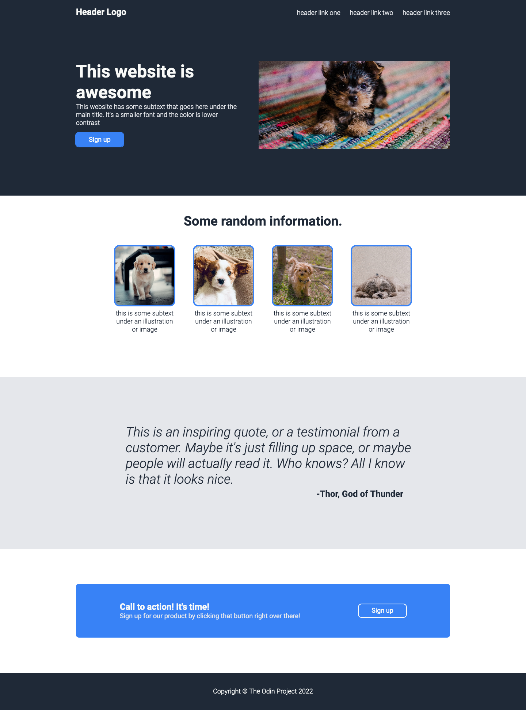

## Table of Contents

- [Overview](#overview)
  - [The Objective](#the-objective)
  - [Built With](#built-with)
- [Acknowledgements](#acknowledgements)

<!-- OVERVIEW -->

## Overview

### The Objective

This project was created as a submission for [The Odin Project](https://www.theodinproject.com/). The [objective](https://www.theodinproject.com/paths/foundations/courses/foundations/lessons/landing-page) was to create a web page from a provided design.

### Built With

- HTML
- CSS
- JavaScript

## Acknowledgements

- Hero image by [hannah grace](https://unsplash.com/@oddityandgrace) on [Unsplash](https://unsplash.com/)
- Random Information first image by [Vander Films](https://unsplash.com/@vanderfilms) on [Unsplash](https://unsplash.com/)
- Random Information second image by [Sophia Kunkel](https://unsplash.com/@sophiakunkel) on [Unsplash](https://unsplash.com/)
- Random Information third image by [sq lim
  ](https://unsplash.com/@sql) on [Unsplash](https://unsplash.com/)
- Random Information forth image by [Adam Grabek](https://unsplash.com/@agmakonts) on [Unsplash](https://unsplash.com/)
